# 前言：

- [ ] 在开始创建k8s/fargateEKS之前，需要准备环境。
- [ ] 比较快捷的方式是创建Cloud9的环境，因为IDE做好好用，大部分的fargateEKS所需库都已经内置。
- [ ] Cloud9的配置也需要按要求做好，因为权限和fargateEKS紧密相连。
- [ ] 通常一个fargateEKS是由一个（开发）团队来运维，这个时候可以将配置成功的Cloud9共享给团队一同使用。这部分的内容可以参考《[AWS Cloud9多用户共享教程与最佳实践](https://github.com/liangyimingcom/AWS-Cloud9-multi-user-sharing-tutorials-and-best-practices)》


<u>下面开始：</u>


# 创建 Cloud9 环境

使用 AWS 用户登录: [https://us-west-2.console.aws.amazon.com/cloud9/home?region=us-west-2](https://us-west-2.console.aws.amazon.com/cloud9/home?region=us-west-2). 

**请将 AWS Region 切换成您的 Workshop 使用的区域。**

创建 Cloud9 环境, 步骤如下面截图所示:

[步骤-1]

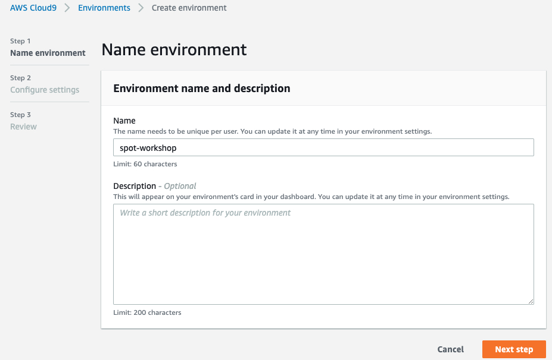

[步骤-2]

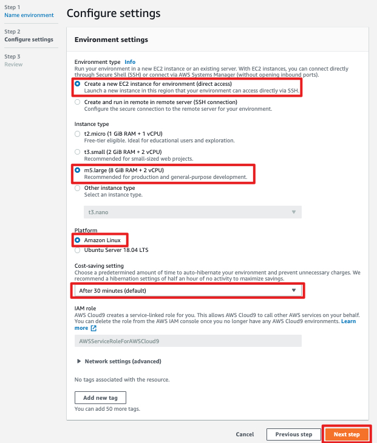

[步骤-3]

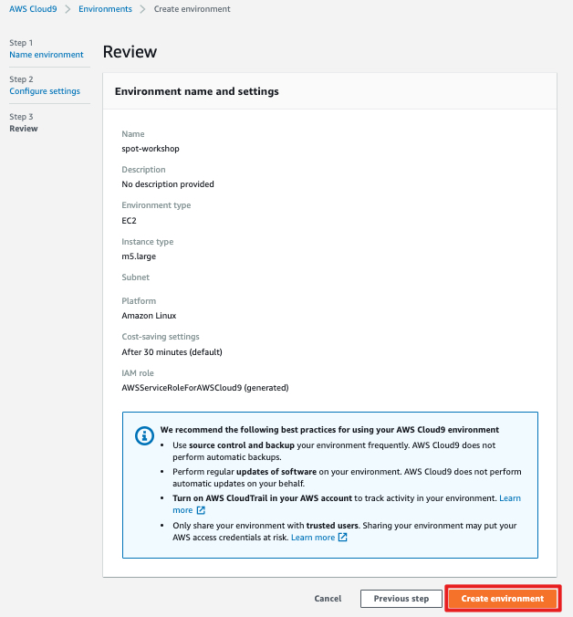


创建完成后，会自动进入 Cloud9 IDE 环境：

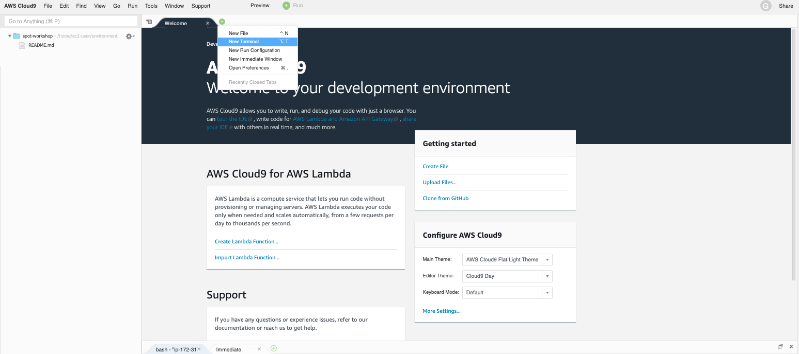

如果退出 IDE 之后要再进入 Cloud9 环境，可以在 Cloud9 界面上点击 Open IDE 按钮：

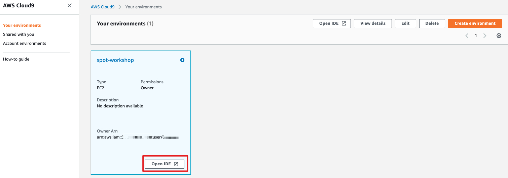


# 安装所需工具和软件包


## 安装 JQ 和 envsubst

```
sudo yum -y install jq gettext
```

## 验证 jq, envsubst

```
for command in jq envsubst
  do
    which $command &>/dev/null && echo "$command in path" || echo "$command NOT FOUND"
  done
```

## 安装 AWS CLI

验证当前版本

```
aws --version
```

更新到最新版本

```
curl "https://awscli.amazonaws.com/awscli-exe-linux-x86_64.zip" -o "awscliv2.zip"
unzip awscliv2.zip
sudo ./aws/install
. ~/.bash_profile
```

确认最新版本安装成功

```
aws --version
```


# 创建 IAM Role


1.  在 AWS Console 选择 IAM 服务

2. 选择 AWS service --> EC2, 点击 "Next: Permissions"

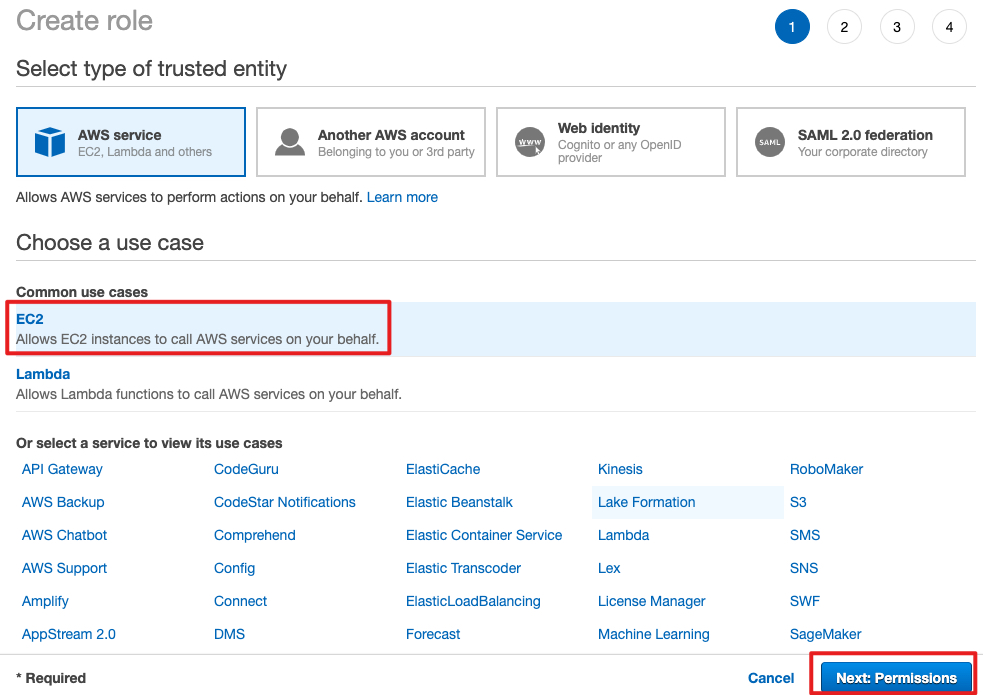

3. 选择 "AdministratorAccess" 权限策略

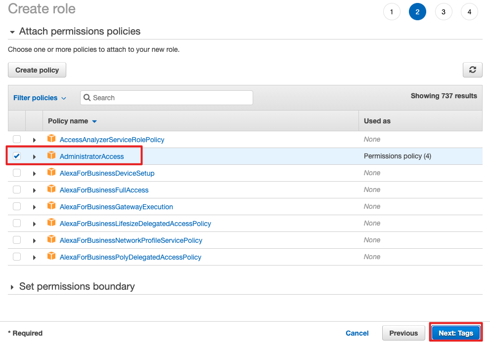

4. 依次选择 “Next: Tags” 和 "Next: Review"

5. 命名角色名称, 比如 "fargate-workshop", 然后点击 "Create role"

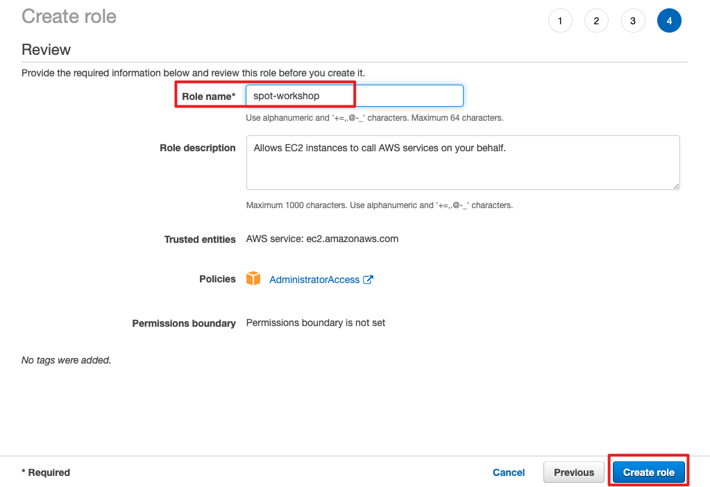


# 添加 IAM Role 至 Cloud9 实例


1. 在 EC2 界面上找到您的 Cloud9 实例

2. 选择 Cloud9 对应的 EC2 实例, 然后选择: Actions --> Instance Settings --> Attach/Replace IAM Role


3. 选择上面创建的角色如 "fargate-workshop", 点击 Apply

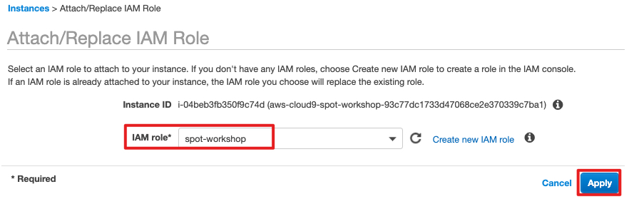

4. 更新 Cloud9 默认的 IAM 权限模式

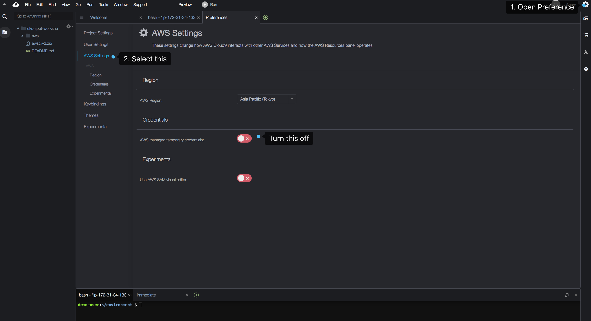


# 更新 Cloud9 环境


删除当前已经保留的 credentials 文件:

```
rm -vf ${HOME}/.aws/credentials
```

配置 AWS CLI 的当前的 region 信息:

```
export ACCOUNT_ID=$(aws sts get-caller-identity --output text --query Account)
export AWS_REGION=$(curl -s 169.254.169.254/latest/dynamic/instance-identity/document | jq -r '.region')

echo "export ACCOUNT_ID=${ACCOUNT_ID}" >> ~/.bash_profile
echo "export AWS_REGION=${AWS_REGION}" >> ~/.bash_profile

aws configure set default.region ${AWS_REGION}
aws configure get default.region
```

验证 Cloud9 已经使用最新的角色关联:

```
aws sts get-caller-identity
```

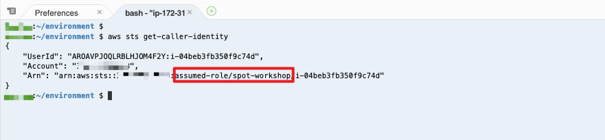


# 如果报错，请修改以下的步骤（yiming update by 2025）
### 报错原因：由于安全考虑，AWS控制带账号登录采用了联邦登录，这导致了在Cloud9里面无法通过 aws sts get-caller-identity --output text --query Account & curl -s 169.254.169.254/latest/dynamic/instance-identity/document 获取到aws accountid & region。 所以这里改为手动输入：

### 禁止修改《更新 Cloud9 环境》的操作步骤：
1、获得Account ID，通过 aws sts get-caller-identity 获得 

2、获得region，这里是孟买所以为ap-south-1 

3、显示输入： 
export ACCOUNT_ID=153705xxxxx
export AWS_REGION=ap-south-1

4、执行命令行： 
aws sts get-caller-identity

能够成功，返回值role也改变了。
